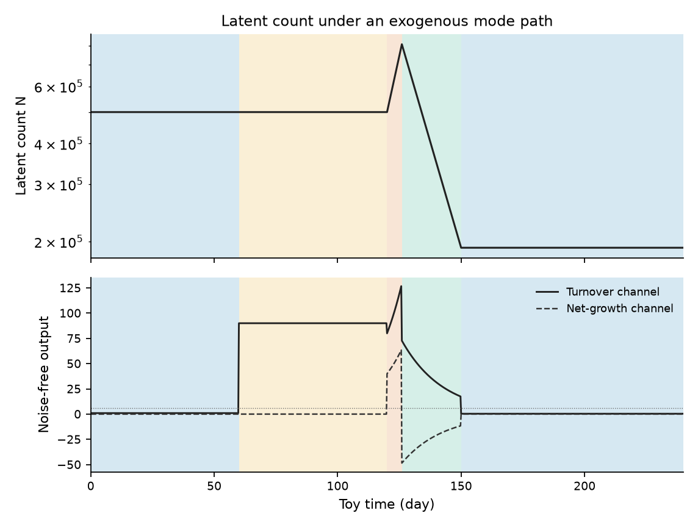
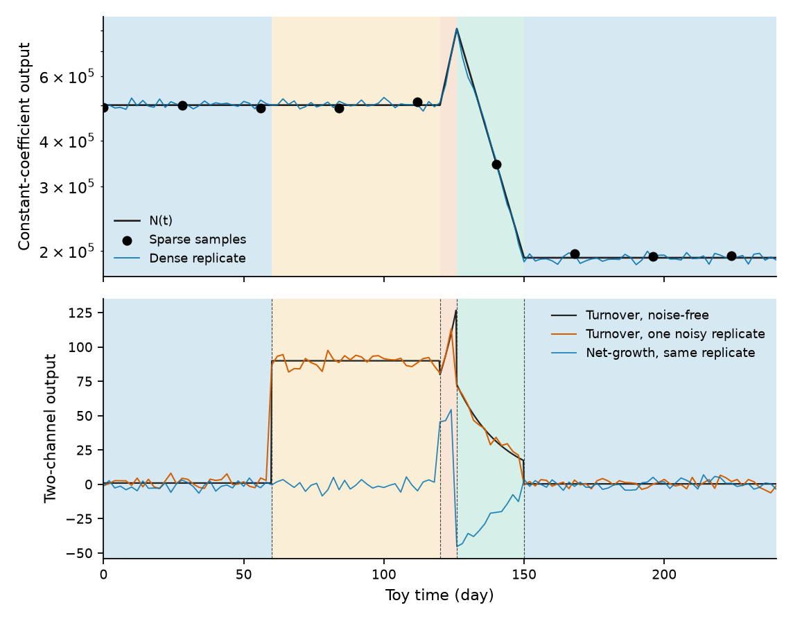
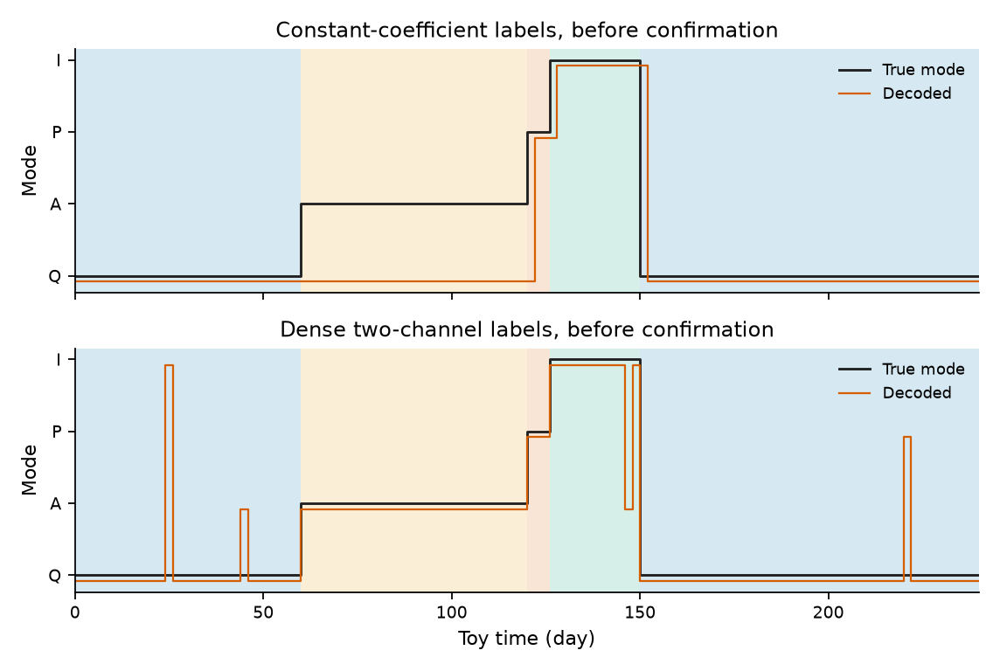
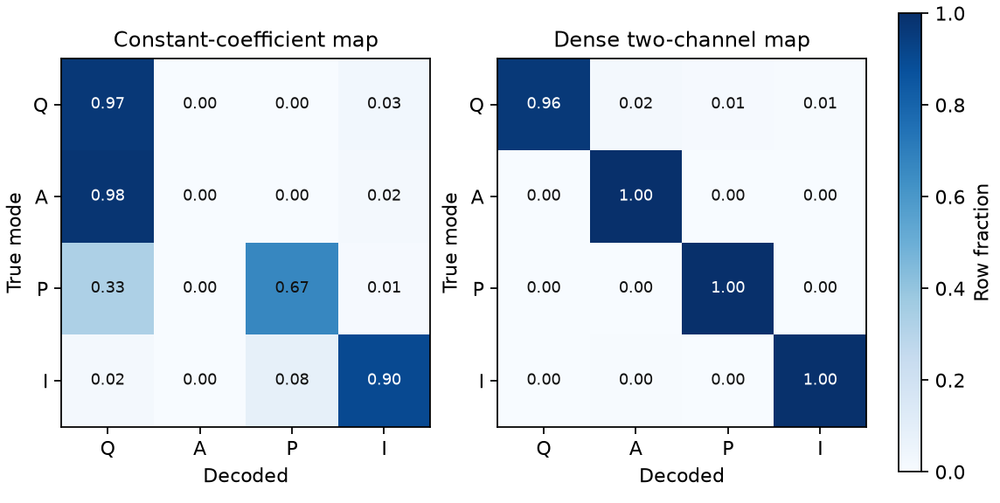
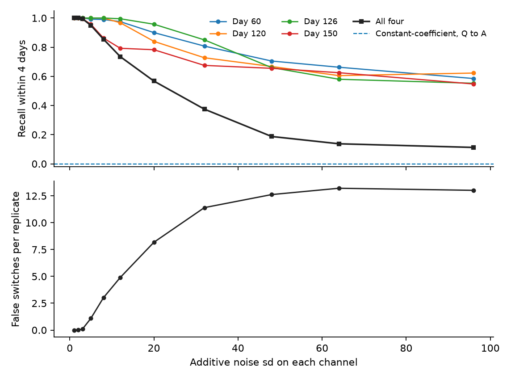

# Liquid-biopsy-style partial observation maps for hybrid occult residual-disease modes

**Thesis #23. Computational research thesis**  
**Author:** Kelechi Emeka Ogbonna  
**Correspondence:** kelechiogbonna300@gmail.com · https://github.com/cloudynirvana/thesis-23-ctdna-partial-observer-occult-modes  
**Date:** 21 September 2026  
**Format:** B.Sc. project chapters (Nile University style), written as a computational methods manuscript  
**Status:** A declared hybrid toy, two observation maps, and a seeded Monte Carlo. Not a measurement of residual disease.  
**Citation style:** numbered Vancouver. A `doi:` field appears only where Crossref or PubMed returned the record.  
**DOI:** none for this document. Do not invent one.

---

## Title page

**LIQUID-BIOPSY-STYLE PARTIAL OBSERVATION MAPS FOR HYBRID OCCULT RESIDUAL-DISEASE MODES**

BY

**KELECHI EMEKA OGBONNA**

A COMPUTATIONAL RESEARCH THESIS  
(IN-SILICO OBSERVATION OPERATORS ON A TOY HYBRID MODEL)

SUBMITTED AS A CITEABLE MANUSCRIPT FOR JOURNAL / THESIS HANDOFF

PROJECT CONFLUENCE  
INDEPENDENT COMPUTATIONAL RESEARCH

SUPERVISOR: not appointed for this deposit

SEPTEMBER 2026

---

## Declaration

I, Kelechi Emeka Ogbonna, declare that this computational research thesis was carried out by me. The trajectories, labels, confusion counts, and switch recalls reported here were produced by `sim/observer_toy.py` at seed 20260921. They are not wet-lab measurements and not patient outcomes. No DOI, ORCID, or journal acceptance was invented for this document.

_________________________     _______________________  
Kelechi Emeka Ogbonna         Date

---

## Abstract

Given a hybrid (switching) occult residual-disease model, which liquid-biopsy-style sparse observation maps can distinguish mode occupancy versus remaining blind to switches — as an observation-operator question, not as a diagnostic device claim?

The plant is a scalar count N(t) driven by an exogenous mode q(t) ∈ {Q, A, P, I}: quiescence, angiogenic pause, a six-day proliferative dwell, and immune-held latency. Birth and death are constant inside a mode. Quiescence and angiogenic pause both have net rate 0, so N stays at 500000 from day 0 to day 120. Their turnovers are 0.002 and 0.180 per day. The proliferative dwell has net rate +0.080. Immune-held latency has net rate −0.060. Switches sit at days 60, 120, 126, and 150.

Two maps are applied to that pair. The constant-coefficient map emits a log-normal series whose median is N. A fixed positive coefficient would only rescale it, and the decoder uses log-slopes, so the series is the cartoon in which shedding per cell does not depend on mode. The two-channel map emits κN(b+d, b−d) plus independent Gaussian noise on each channel, with κ = 10−3. On the shared plateau the noise-free channels are (1, 0) in quiescence and (90, 0) in angiogenic pause. The gap is 89.

On the constant-coefficient map, a normal approximation rejects equal window means in 16 of 400 replicates (rate 0.040). The switch at day 60 is recovered inside a 4-day tolerance in 0 of 400 replicates, on a 2-day grid and on a 28-day grid. Angiogenic pause is labelled Q on 0.980 of its samples. The decoder is not permitted to emit A. Density of the clock does not repair a map that cannot see turnover.

The two-channel map on a 28-day grid has no sample inside the proliferative dwell. It emits the label P in 0.080 of replicates, from threshold crossings elsewhere. Its day-60 event falls at the midpoint of the bracketing samples and outside the 4-day tolerance. The same map on a 2-day grid, at noise sd 3, matches all four switches in 398 of 400 replicates. The median absolute error of matched times is 0 days on the aligned grid and 1 day on a grid offset by one day. At noise sd 5 the four-switch fraction is still 0.950, and false switches have risen to 1.085 per replicate. At noise sd 32 that fraction is 0.375, with 11.408 false switches per replicate.

The series are synthetic. They are not a validated assay.

---

## Keywords

observation operator; hybrid switching; liquid-biopsy-style map; ctDNA-like series; mode occupancy; quiescence; angiogenic pause; toy model; practical identifiability; research only

---

## Table of Contents

DECLARATION  
ABSTRACT  
Table of Contents  
List of tables and figures  

CHAPTER ONE. INTRODUCTION  
1.1 Background to the study  
1.2 STATEMENT OF RESEARCH PROBLEM  
1.3 JUSTIFICATION OF STUDY  
1.4 AIM AND OBJECTIVES OF THE STUDY  
1.5 SIGNIFICANCE OF THE STUDY  
1.6 SCOPE OF THE STUDY  

CHAPTER TWO. LITERATURE REVIEW  
2.1 A liquid biopsy is already an operator  
2.2 Shedding is not the cell count  
2.3 Other functionals from one draw  
2.4 Four pauses do not share a turnover  
2.5 Switched systems can hide the switch  
2.6 Structural blindness and practical noise  

CHAPTER THREE. MATERIALS AND METHODS  
3.1 Design  
3.2 The hybrid toy  
3.3 Two maps, two clocks  
3.4 Propositions  
3.5 Decoder, fixed in the script  
3.6 Monte Carlo  
3.7 What was not done  

CHAPTER FOUR. RESULTS  
4.1 The plateau is shared, and the channels are not  
4.2 A constant coefficient is blind to one switch  
4.3 A coarse clock misses a short dwell  
4.4 A fine two-channel map recovers the four times  
4.5 The recovery stops at a finite noise  
4.6 Checks  

CHAPTER FIVE. DISCUSSION, CONCLUSION AND RECOMMENDATION  
5.1 Discussion  
5.2 Conclusion  
5.3 Recommendation  

REFERENCES  
DISCLAIMER  

---

## List of tables and figures

**Table 3-1.** Per-capita rates by mode.  
**Table 3-2.** Maps and clocks.  
**Table 3-3.** Decoder constants.  
**Table 4-1.** Noise-free landmarks.  
**Table 4-2.** Switch recall at noise sd 3, tolerance 4 days.  
**Table 4-3.** Two-channel dense map against the noise sd.

**Figure 4-1.** Latent count and noise-free channels.  
**Figure 4-2.** One noisy replicate of each map.  
**Figure 4-3.** Per-sample labels before confirmation.  
**Figure 4-4.** Confusion matrices at noise sd 3, or the matching burden noise.  
**Figure 4-5.** Recall and false switches against noise sd.

Figures are diagnostics from `sim/observer_toy.py`. They are not measured plasma series.

---

# CHAPTER ONE

## 1.0 INTRODUCTION

### 1.1 Background to the study

A liquid biopsy, in the reviews that argued for its clinical use, is a blood draw asked to stand in for a tissue sample: circulating tumour DNA, circulating tumour cells, and a growing list of fragment and methylation features [1–4]. The sentences in those reviews are about implementation, sensitivity, and the management of a patient. This thesis borrows only the shape of the observation. A draw is a map from a hidden state to a short vector, taken on a clock the sampler chose. The map can be sparse. It can also be blind to a distinction the hidden state still carries.

Circulating tumour DNA is not a slow integral of tumour mass. Diehl and colleagues treated mutant fragments in plasma as a dynamic readout and reported a short half-life after resection, of the order of two hours [5]. Avanzini and colleagues wrote an explicit shedding model in which detection depends on a rate times a size, and they used that product to talk about the size at which a tumour becomes visible to a given assay [6]. A daily sample of a fast-cleared species is, to a good approximation, a sample of the shedding rate that day. If the shedding rate factors as a per-cell turnover times a cell count, a series proportional to the count alone has already thrown the turnover away.

Occult residual disease is a setting in which that factorisation matters. Cellular quiescence, angiogenic dormancy, and immune equilibrium are different biological pauses [7–9]. Holmgren, O'Reilly, and Folkman measured a micrometastatic mass held flat by a balance of proliferation and apoptosis when angiogenesis was suppressed [8]. Koebel and colleagues showed that adaptive immunity can maintain occult cancer in an equilibrium that depletion disturbs [9]. A flat count is compatible with almost no turnover and with a large turnover. Those are different shedding rates. The mode names used for them in the toy below — quiescence Q, angiogenic pause A, proliferative residual P, immune-held latency I — are the names of a companion architectural manuscript, which refuses to encode occult residual disease as an extra continuous coordinate [10].

The present question is narrower than that refusal, and it is numerical. The mode path is given. The count is a one-dimensional consequence of the mode. The unknown is which observation map can tell the modes apart. May's warning applies before any clinical noun is reused: an equation borrowed from a neighbouring field still has to be the equation the prose describes [11]. Saltelli and colleagues make the same demand of any model that might be mistaken for a decision [12]. A switch time recovered inside a toy is a property of an operator. It is not a relapse call.

### 1.2 STATEMENT OF RESEARCH PROBLEM

Given a hybrid (switching) occult residual-disease model, which liquid-biopsy-style sparse observation maps can distinguish mode occupancy versus remaining blind to switches — as an observation-operator question, not as a diagnostic device claim?

The working form is a single trajectory and a Monte Carlo on its outputs. There is one exogenous mode schedule. There is one latent count. There is a constant-coefficient map, which is what a shedding series becomes when the shedding coefficient is not allowed to depend on the mode. There is a two-channel map, whose channels are turnover and net growth, each multiplied by the same count. Each map is read on a 28-day grid and on a 2-day grid. Noise is declared. A decoder with fixed constants either places the four switch times inside a 4-day tolerance or it does not.

Blindness, if it happens, is a property of a map on this trajectory. It is not a statement about every assay that has been called a liquid biopsy [1,11]. A familiar way to miss the question is to treat a sensitive scalar series as if sensitivity and mode resolution were the same virtue. A series can track N closely and still assign one label to two modes that share N.

### 1.3 JUSTIFICATION OF STUDY

The constant-coefficient cartoon is short enough to repeat, and it is the cartoon that makes ctDNA "track tumour burden." Kalman already separated the state from the matrix that reads it [13]. Hermann and Krener made the nonlinear version of that separation a rank condition on the output map [14]. Neither paper is about plasma. Both say that a state can be present and still be invisible to a chosen output. For a finite mode set the relevant failure is sharper: each mode can have a perfectly visible count, while the mode index remains free.

Raue and colleagues showed that partial observation is where practical identifiability dies, even when a structural symbol count looks favourable [15]. Wieland and colleagues separate that practical failure from structural non-identifiability, which infinite noise-free data will not repair [16]. The day-60 switch is offered as a structural case. Quiescence and angiogenic pause produce the same N(t). A map that is a function of N and of noise that does not know the mode has the same law under both. No increase in the number of samples changes the law. A map that reads turnover has, on this plateau, noise-free means 1 and 90. Whether that gap survives a declared noise level is the practical question. The two failures are different, and a thesis that reports only a sensitivity has folded them together [15,16].

The study is justified as that separation. It is not justified as an assay, a monitoring interval, or a residual-disease call [12].

### 1.4 AIM AND OBJECTIVES OF THE STUDY

The aim is to state the comparison of liquid-biopsy-style maps as a falsifiable computational object on the toy in Chapter Three, and to test which of the declared maps recover the four switch times under the declared noise.

The objectives are:

1. Write a hybrid toy whose quiescence and angiogenic-pause intervals share a latent count and do not share a turnover.
2. Define a constant-coefficient map and a two-channel map, each on a sparse clock and a dense clock.
3. Prove the equal-law claim, the scale-free ratio, the plateau gap, and the aliasing of the six-day dwell, and check them in the generator.
4. Run the fixed decoder for 400 replicates at seed 20260921, and sweep the two-channel noise.
5. Keep assay validation, clinical sensitivity, and any reading of a switch time as a relapse outside the aim.

Non-aims. Estimating guards from data. Fitting a plasma clearance ODE. Sampling sequencing reads. Claiming a limit of detection for a named platform. Interpreting a mode letter as a histology.

### 1.5 SIGNIFICANCE OF THE STUDY

The useful product is a pair of failures that can be told apart in public. If the constant-coefficient map on the 2-day grid recovered the switch at day 60, the claim that turnover is doing the work would fail. If the two-channel map on the 28-day grid labelled the interior of the six-day dwell as proliferative, the aliasing claim would fail. If every noise level in the sweep recovered the four times with almost no false switches, the practical bound would fail [11,12].

There is a second product inside the same script. Match rate and false-switch rate do not move together. A noise level can keep most true times and still decorate the trajectory with extra switches. That split is what stops a single recall number from being promoted into "the map works."

What the significance is not: a specification for a blood test, a recommended sampling interval, or a replacement for the clinical series that motivated the operator language [1,5,6].

### 1.6 SCOPE OF THE STUDY

In scope. One exogenous four-mode schedule on a 240-day horizon. Closed-form exponential counts. A log-normal constant-coefficient map. An additive Gaussian two-channel map. Grids of 28 days and 2 days, plus one dense grid offset by a day. Four hundred replicates. The decoder constants in Section 3.5.

Out of scope. Human or animal plasma. Fragment-length measurement, methylation arrays, and panel sequencing. A stochastic mode process. Filippov sliding on a state-dependent guard. Drug inputs. Any regulatory use.

---

# CHAPTER TWO

## 2.0 LITERATURE REVIEW

### 2.1 A liquid biopsy is already an operator

Wan and colleagues reviewed circulating tumour DNA at the point where the technical literature was turning into an implementation argument [1]. Heitzer and colleagues set the same material inside genomics-driven oncology and spent much of the review on what a blood draw does not resolve [2]. Siravegna and colleagues wrote the clinical-management version of that argument [3]. Alix-Panabières and Pantel put circulating cells and circulating DNA side by side and treated them as different analytes from one clinical idea [4]. The common object, for this thesis, is not the analyte. It is the decision to compress a disease state into the output of a draw.

Serial ctDNA in metastatic breast cancer was already being read as a monitoring curve by Dawson and colleagues [17]. Newman and colleagues showed that a deeper targeted method changes how small a mutant fraction can be seen [18]. Depth moves a floor. It does not by itself add a second functional of the hidden state. Abbosh and colleagues, in the TRACERx cohort, used ctDNA phylogeny to follow clonal evolution in early-stage lung cancer [19]. That is a map from plasma to clone identity. It is a different unknown from the mode index in Chapter Three.

The minimal-residual-disease papers make the scalar series do still more work. Tie and colleagues reported recurrence prediction from ctDNA after stage II colon cancer [20]. Garcia-Murillas and colleagues tracked mutations in early breast cancer and read a lead time on relapse [21]. Chaudhuri and colleagues did the analogous early detection of molecular residual disease in localised lung cancer [22]. Pantel and Alix-Panabières later reviewed that residual-disease literature under the heading of cure [26]. Those studies are cited here as the genre of claim a scalar series is asked to carry. This repository does not repeat their cohorts, and it does not estimate their sensitivities. Kurtz and colleagues thickened the molecular side of the same genre by sequencing phased variants [23]. Wan and colleagues later combined patient-specific panels with an integration of variant reads [24]. A denser molecular representation is still an operator. It becomes a mode observer only after someone states which feature is supposed to move when the mode moves.

Bettegowda and colleagues had already shown that detectability is not uniform across stage or site [25]. A single shedding coefficient, applied to every occult mode, is an assumption those detection rates do not grant. The assumption is exactly the constant-coefficient map of Chapter Three.

### 2.2 Shedding is not the cell count

Diehl's half-life estimate is what licenses a quasi-steady reading on a daily grid [5]. If plasma clearance is measured in hours, a sample taken every two days is not integrating a long memory of old fragments. It is close to the shedding rate at the sampling instant. Avanzini and colleagues put a related structure in a detection model: the observable depends on a shedding coefficient times a tumour size, and the size at which detection becomes likely is a function of that coefficient [6]. Change the coefficient and the same size crosses or misses the floor.

This thesis does not integrate a clearance ODE. The two channels in Section 3.3 are the quasi-steady functionals, not the solution of a plasma compartment. Calling them ctDNA would be a change of name. They are ctDNA-like in the factorisation they keep: a rate times a count, plus a second coordinate for the sign of net growth.

Razavi and colleagues complicate even that factorisation. High-intensity sequencing of plasma cell-free DNA finds variants whose source is often clonal haematopoiesis rather than the tumour [27]. A mutant read is not a mode, and it is not automatically a tumour-derived fragment. The toy has no haematopoietic compartment. The citation is a boundary on the interpretation, not a term in the generator.

### 2.3 Other functionals from one draw

Fragment length is one way a single draw has already been treated as more than a mutant count. Jiang and colleagues described lengthening and shortening of plasma DNA in hepatocellular carcinoma [28]. Underhill and colleagues measured the fragment-length distribution of circulating tumour DNA against the background of other cell-free DNA [29]. Snyder and colleagues read cell-free DNA as an in vivo nucleosome footprint that carries tissue-of-origin information [30]. Moss and colleagues built a cell-type methylation atlas and used it to attribute circulating cell-free DNA in health and disease [31]. These papers do not report hybrid tumour modes. They do establish a weaker, and useful, fact. Two summaries of one tube can be different functions of the underlying mixture.

The second channel in this thesis is not a fragment length and not a methylation proportion. It is κN(b−d), a signed net-growth coordinate. The literature above is the reason a two-dimensional output is a legitimate liquid-biopsy-style object to write down. It is not evidence that any of those assays separates quiescence from angiogenic pause. That separation is tested here only on the toy.

### 2.4 Four pauses do not share a turnover

Aguirre-Ghiso's review is the biological source of the split this generator keeps [7]. Cellular dormancy is an arrest. Angiogenic dormancy is a population balance with proliferation still running. Immune control is a third pause. Holmgren's measurements give the balance a classical experimental form: proliferation and apoptosis both proceed, and the mass does not grow, when angiogenesis is suppressed [8]. Koebel's equilibrium gives the immune pause its classical form [9]. Hanahan and Weinberg list sustained proliferative signalling and the induction of angiogenesis as distinct acquired capabilities [32]. A model that stores only the difference b−d has already decided that the sum b+d is not part of the observation. The toy stores both, and then lets one of the maps discard the sum.

The rates in Table 3-1 are not estimates from the dormancy papers. They are round numbers chosen so that two modes share a net rate and do not share a turnover. The mode names themselves were fixed in Section 1.1.

### 2.5 Switched systems can hide the switch

Kalman's filter paper is the linear statement: the output is a matrix times the state, plus noise, and observability is a property of that matrix together with the dynamics [13]. Hermann and Krener extend observability to nonlinear maps by a rank condition on derivatives of the output along the vector field [14]. The toy here is simpler than that test and, on one point, more specific. The continuous state is one-dimensional and solved in closed form. The discrete mode is an exogenous input. A rank condition on N would say that the count is observable from a monotone function of itself. It would not say that the mode is observable.

Vidal, Chiuso, Soatto, and Sastry studied observability of linear hybrid systems and showed that the mode sequence is part of what the output has to determine [33]. Babaali and Egerstedt gave conditions under which a switched linear system is observable, and the conditions are not the observability of the individual modes [34]. De Santis and Di Benedetto survey the hybrid case and keep mode detection distinct from state detection [35]. Liberzon's book is the switched-system setting used here: a family of vector fields and a switching signal that selects among them [36]. The signal q(t) in Chapter Three is imposed. It is not inferred from a guard.

Filippov's framework covers a different object, differential equations whose right-hand side is discontinuous across a surface, including convex combinations when the fields slide [37]. The toy does not slide. Switches are timed by the schedule, not by a threshold on N. The citation marks that boundary so a later reader does not import a sliding mode into a clock that was written by hand.

### 2.6 Structural blindness and practical noise

Raue's profile-likelihood programme is aimed at continuous parameters of a partially observed ODE [15]. The mode index is discrete, so the profile is not computed. The moral that transfers is the one about the output map. If the output does not move when the unknown moves, the profile is flat, and the flatness is not cured by a longer series of the same output. Wieland's review states the same split in the current vocabulary: structural non-identifiability survives infinite noise-free data; practical non-identifiability is what finite noisy data do to a structurally available parameter [16].

Chapter Four uses that split literally. The constant-coefficient comparison of quiescence with angiogenic pause is the structural case. The two-channel sweep is the practical case. May's abuse is the sentence that would report the second curve as a property of patients [11]. Saltelli's demand is the reason the false-switch panel is plotted beside the recall panel [12]. A match rate with the false alarms cropped out would be a model serving a slogan.

---

# CHAPTER THREE

## 3.0 MATERIALS AND METHODS

### 3.1 Design

The generator is fixed. Seed 20260921 governs every Gaussian and log-normal draw. The mode schedule is deterministic. Software is `sim/observer_toy.py`. No differential equation is integrated numerically: inside each mode the count is an exponential, and the output is evaluated on the sampling grid.

One revision rule is imposed on the decoder constants and on the schedule. They are not to be edited in order to push a failed switch across the 4-day line, or to push the constant-coefficient map into emitting the label A. The angiogenic-pause interval is supposed to be invisible to that map. A later edit that hands the decoder a turnover feature would be a different map. The rule is a constraint on this deposit. It is not a biological axiom and not a clinical instruction [12].

### 3.2 The hybrid toy

Time is in days. The horizon is [0, 240]. The mode q(t) is piecewise constant on the five intervals in Table 3-1. The latent count obeys

dN/dt = (bq − dq) N, &nbsp; N(0) = 500000.

Birth bq and death dq are per-capita rates. The solution on a piece that starts at time t0 with value N(t0) is N(t0) exp((b−d)(t−t0)). The count is continuous at switches. There is no jump map.

**Table 3-1.** Rates per day. Turnover is b+d. The ratio ρ = (b−d)/(b+d).

| Interval (day) | Mode | Birth | Death | Net | Turnover | ρ |
| --- | --- | ---: | ---: | ---: | ---: | ---: |
| [0, 60) | Q | 0.001 | 0.001 | 0 | 0.002 | 0 |
| [60, 120) | A | 0.090 | 0.090 | 0 | 0.180 | 0 |
| [120, 126) | P | 0.120 | 0.040 | 0.080 | 0.160 | 0.500 |
| [126, 150) | I | 0.015 | 0.075 | −0.060 | 0.090 | −0.667 |
| [150, 240] | Q | 0.001 | 0.001 | 0 | 0.002 | 0 |

Quiescence and angiogenic pause are the structural pair: the same net rate, turnovers that differ by a factor of 90. The proliferative piece lasts six days, shorter than the sparse sampling gap. Immune-held latency lasts 24 days and is the only interval with a negative net rate. The letters are row labels for q. They are not histologies [7,11].

Because the first two net rates are zero, N(t) = 500000 on the whole of [0, 120]. At the end of the proliferative dwell,

N(126) = 500000 exp(0.080 × 6) = 500000 exp(0.48).

The generator stores 808037.201. At day 150, after 24 days of net rate −0.060,

N(150) = N(126) exp(−1.44),

stored as 191446.443. The second quiescence holds that value to day 240.

### 3.3 Two maps, two clocks

The noise-free two-channel mean at time t is

μ(t) = κ N(t) (bq + dq, &nbsp; bq − dq), &nbsp; κ = 10−3.

The first coordinate is a turnover channel. The second is a net-growth channel. Both scale with N, so their ratio equals ρq whenever the first coordinate is positive. On the opening plateau the quiescence mean is (1, 0) and the angiogenic-pause mean is (90, 0).

The constant-coefficient map does not use μ. Its observation is

yB(t) = N(t) exp(σB ε), &nbsp; σB = 0.02,

with ε standard normal, independent across samples. The median of yB is N. A mode-independent shedding coefficient c > 0 would replace N by cN. Log-slopes cancel c. The series in the script is therefore the constant-coefficient ctDNA-like cartoon, written at c = 1 so that the numerical values remain the cell count. It is not a claim that plasma contains a count.

**Table 3-2.** Maps. Dense times are 0, 2, …, 240 (121 samples). Sparse times are 0, 28, …, 224 (9 samples). The offset dense grid is 1, 3, …, 239.

| Map | Output | Clock | Noise |
| --- | --- | --- | --- |
| Constant-coefficient, dense | yB | 2 days | log-normal, sd 0.02 |
| Constant-coefficient, sparse | yB | 28 days | log-normal, sd 0.02 |
| Two-channel, dense | μ + σ ε in R2 | 2 days | Gaussian, sd σ per channel |
| Two-channel, sparse | μ + σ ε in R2 | 28 days | Gaussian, sd σ = 3 |
| Two-channel, offset | μ + σ ε in R2 | 2 days, phase 1 | Gaussian, sd σ = 3 |

The primary two-channel noise is σ = 3. The sweep uses σ ∈ {1, 2, 3, 5, 8, 12, 20, 32, 48, 64, 96}. Noise is independent across channels, times, and replicates. It is not a binomial draw of sequencing reads.

### 3.4 Propositions

The following statements are about the maps just defined. They are not theorems about plasma assays.

**Proposition 1 (Equal laws).** Let two modes produce the same function N(t) on an interval, and let the observation be a function of N and of noise whose law does not depend on the mode. Then the samples on that interval are equal in law under the two modes.

The constant-coefficient map has this form. On [0, 120] the count is identically 500000, so every window inside quiescence and every window inside angiogenic pause has the same distribution. A likelihood ratio that uses only those samples is 1. No decoder has power above its size.

**Proposition 2 (Scale-free ratio).** For N > 0 and κ > 0,

μ2 / μ1 = (bq − dq) / (bq + dq) = ρq.

The ratio does not determine the count. For Table 3-1, ρQ = ρA = 0, ρP = 1/2, and ρI = −2/3. The ratio separates {P}, {I}, and the pair {Q, A}. It does not separate Q from A.

**Proposition 3 (Plateau gap).** On the opening plateau, N = 500000, so the turnover channel equals 1 in quiescence and 90 in angiogenic pause. The absolute gap is

κ N (0.180 − 0.002) = 89.

The constant-coefficient map does not see this gap. The two-channel map sees it in the first coordinate. The gap is a property of this trajectory, which holds N fixed, and of these rates. A much smaller angiogenic-pause population could match the quiescent shedding. That alternative trajectory is not the one generated here.

**Proposition 4 (Aliasing).** The sparse grid is {0, 28, …, 224}. The proliferative interval [120, 126) contains none of those points. It contains three points of the aligned dense grid: 120, 122, and 124.

A decoder that sees only the sparse samples never receives an input whose true mode is P. Any P label it emits is a label at some other time.

**Proposition 5 (Slope lag).** The constant-coefficient label at a sample tk, for k ≥ 1, is a function of yB(tk) and yB(tk−1) only. If N is continuous and the net rate changes at tk, the increment ending at tk was still accumulated at the old rate. The new rate is first visible in the increment that ends at tk+1.

On the aligned grid that lag is one sample, which is 2 days. The switch at day 120 changes the mode at an instant when N has not yet moved, so the slope ending at day 120 is the flat slope.

**Proposition 6 (Offset delay).** On the grid 1, 3, …, 239, each switch 60, 120, 126, 150 lies one day before the next sample. A noise-free two-channel decoder that backdates a confirmed label to the first sample of the new run therefore places each event one day after the true switch.

### 3.5 Decoder, fixed in the script

**Table 3-3.** Constants. They are not fitted.

| Symbol | Value | Role |
| --- | --- | --- |
| τ | 6 | If the turnover channel is below τ, label Q |
| Slope gates | +0.040 and −0.030 | Constant-coefficient log-slope to P or to I |
| Hold | 2 samples | A new label must repeat before a switch is emitted |
| Tolerance | 4 days | A true switch is matched if some event lies within 4 days |

The two-channel per-sample rule uses the noise-free ordering of the channels. The largest quiescent turnover on the dense grid is 1. The smallest turnover among non-quiescent dense samples is 19.427, at the last immune sample. The gate τ = 6 sits between them. If the first channel is at least 6, the label is the nearest of {P, A, I} in the ratio y2/y1, with targets 1/2, 0, and −2/3. The constant-coefficient rule never targets A. A log-slope above 0.040 is P, a log-slope below −0.030 is I, and every remaining slope is Q. The tie is declared. Swapping the name of the flat class would move the angiogenic-pause column and would not create a new feature.

Switch times are not the raw label changes. A run of a new label must reach length 2. The event is then stamped at the first sample of that run, which removes the confirmation lag from the timestamp and leaves it in the confirmed ribbon. Sparse two-channel events are an exception: with samples 28 days apart, the event is the midpoint of the two samples whose raw labels differ, and no hold is applied. A single sparse sample is already the whole observation of its bin.

A true switch is recovered when at least one unmatched event lies within 4 days of it. Matching is greedy, nearest first, and each event is used at most once. Events left over are false switches. The median absolute error is computed on matched pairs only.

The script's reporting cut, used only as a pass rule for the sweep, calls a noise level recovering when the fraction of replicates that match all four switches is at least 0.90 and the mean number of false switches is at most 0.25. The cut labels the curve. It is not a threshold in the generator.

### 3.6 Monte Carlo

Each summary uses 400 replicates. The random number generator is NumPy's `default_rng` at seed 20260921, drawn in this order: constant-coefficient dense, constant-coefficient sparse, the two-channel sweep from σ = 1 upward, the sparse two-channel map at σ = 3, then the offset grid at σ = 3. The plotted replicate is replicate 0 of the relevant stream. One noise-free two-channel pass checks Propositions 2, 3, and 6 before any draw is taken.

Window means for Proposition 1 use the dense constant-coefficient samples with times in [8, 52] and in [68, 112], twenty-three samples each. Both windows lie inside the shared plateau and away from the switch. For each replicate the absolute difference of the two sample means is divided by 500000, and a normal approximation rejects when that difference exceeds 1.96 standard errors. This is not a Welch t-test. With twenty-three samples a side, the normal critical value is slightly more liberal than a t critical value. The rate is reported as a rate, next to the median gap.

### 3.7 What was not done

No clearance ODE was integrated [5]. No sequencing depth was simulated [18,23]. Fragment length and methylation were not computed [28–31]. Clonal haematopoiesis was not given a compartment [27]. The mode path was not drawn from a Markov chain, and no guard was estimated [36,37]. Clinical series were not reanalysed [17,19–22,24–26]. A profile likelihood for a continuous parameter vector was not computed [15]. The rates were not identified from the outputs; the outputs were scored against known rates.

---

# CHAPTER FOUR

## 4.0 RESULTS

### 4.1 The plateau is shared, and the channels are not

N(30) and N(90) are both 500000, to an absolute error below 10−6 in the generator. The noise-free two-channel values at those times are (1, 0) and (90, 0). Proposition 3's gap of 89 is the stored subtraction. At day 120 the mode is already P, the count has not moved, and the channels are (80, 40), so the ratio is 1/2. At day 126 the count is 808037.201 and the channels are (72.723, −48.482), ratio −0.666667, which is the six-decimal rounding of −2/3. At day 150 the mode is again Q, the count is 191446.443, and the turnover channel is 0.383. The second quiescence is quieter than the first because the immune interval has reduced N. Figure 4-1 shows the flat count across the first two modes and the channels that do not stay flat.

**Figure 4-1.** Top: N(t) on a logarithmic axis. Bottom: noise-free turnover channel (solid) and net-growth channel (dashed). The dotted horizontal line is τ = 6. Background bands mark the mode intervals in Table 3-1. The six-day proliferative dwell is the narrow band at day 120.

**Table 4-1.** Noise-free landmarks from `sim/results.json`.

| Name | Day | Mode | N | Turnover channel | Net-growth channel |
| --- | ---: | --- | ---: | ---: | ---: |
| Mid-quiescence | 30 | Q | 500000 | 1 | 0 |
| Mid-pause | 90 | A | 500000 | 90 | 0 |
| Proliferative entry | 120 | P | 500000 | 80 | 40 |
| Immune entry | 126 | I | 808037 | 72.723 | −48.482 |
| Second quiescence | 150 | Q | 191446 | 0.383 | 0 |

The noise-free two-channel decoder reproduces the true mode at every dense sample. Its confirmed events are exactly 60, 120, 126, and 150, each with error 0, and it emits no false switch. On the offset grid the same noise-free pass places the four events at a delay of 1 day, which is Proposition 6.

### 4.2 A constant coefficient is blind to one switch

The equal-law check uses 400 independent draws of the dense constant-coefficient map. The median absolute gap between the two window means, divided by 500000, is 0.003927. The 95th percentile of that relative gap is 0.011165. The normal approximation rejects in 16 replicates, rate 0.040. A 5% test under a true null would reject about 20 times. The observed rate sits next to that count. Nothing in these windows distinguishes angiogenic pause from quiescence.

The switch recall makes the same point on the event list. Within 4 days, the day-60 switch is recovered in 0 of 400 replicates. The day-120 switch is recovered in all 400, with median absolute error 2 days. Day 126 is recovered in 392 replicates and day 150 in 394, each with median absolute error 2 days. The 2-day median is the slope lag of Proposition 5: the new net rate is first visible one sample after the switch, and the event is stamped there. False switches average 0.0375 per replicate, which is 15 events in the whole Monte Carlo.

The confusion matrix counts raw labels, before the two-sample confirmation. Of angiogenic-pause samples, 0.980 are labelled Q, 0.017 are labelled I, and 0.003 are labelled P. The A column is empty. The decoder cannot say A, and the data do not force it to invent a second flat class. Of proliferative samples, 0.666 are labelled P and 0.326 are labelled Q. There are three proliferative samples on the dense grid. The one at day 120 compares a flat predecessor with a count that has not yet grown, so the flat label on that sample is the lag, and two of the three samples carry the positive slope. Of immune-held samples, 0.901 are labelled I and 0.083 are labelled P. The immune sample at day 126 is scored from the slope over [124, 126], which still lies inside the proliferative dwell, so one immune sample in twelve is labelled P by the same lag. Quiescent samples are labelled Q on a fraction 0.968.

A 2-day clock is enough for this map to notice a change in net growth, late by a sample. It is not enough to notice a change in turnover at constant N. Figure 4-2, top panel, is one replicate: the dense curve and the sparse points follow N through day 60 with no break.

**Figure 4-2.** Top: constant-coefficient output for replicate 0, dense curve and sparse points, against N(t). Bottom: the same time axis for the two-channel replicate at σ = 3. Dashed vertical lines are the four true switches. The top series is continuous across day 60. The turnover channel in the bottom series steps from about 1 to about 90.

### 4.3 A coarse clock misses a short dwell

The sparse grid contains no time in [120, 126). Proposition 4 is a set-membership check in the script, and it passes. The constant-coefficient sparse decoder recovers none of the four switches inside 4 days, in any of the 400 replicates. A negative slope does appear between the samples at day 140 and day 168, because N falls during the immune interval, but the label change is stamped at day 168. That is 18 days after the immune-to-quiescence switch, outside the tolerance. Seeing a decline somewhere in a 28-day bin is not the same event as placing the switch.

The sparse two-channel map, at σ = 3, has the turnover feature and still has the coarse clock. The label P occurs in 32 of 400 replicates (fraction 0.080). Every sparse time has a true mode other than P, so those labels are threshold crossings on other samples, mostly quiescent samples whose noise reaches τ. They are not detections of the six-day dwell.

Switch placement uses midpoints. The samples at days 56 and 84 bracket day 60, and the midpoint is day 70, which is 10 days away. Recall of day 60 inside the tolerance is 0. The samples at days 112 and 140 bracket both day 120 and day 126. Their midpoint is day 126. Recall of day 126 is 0.9975, with median error 0, because the midpoint lands on that switch. Recall of day 120 is 0, because the same midpoint is 6 days from it. The next midpoint, between days 140 and 168, is day 154, which is exactly 4 days after day 150 and therefore inside the closed tolerance. Recall of day 150 is 0.9975, with median absolute error 4 days. The fraction of replicates that match all four switches is 0. False switches average 1.305 per replicate.

The arithmetic is the result. A rich map on a 28-day grid can drop an event on top of one switch by the midpoint of a bin that also swallowed the previous switch, and it can sit on the boundary of the tolerance for another. The proliferative mode itself is absent from the sample set. Coarsening the clock is a different failure from deleting the turnover channel, and neither failure is repaired by the other map's virtue.

### 4.4 A fine two-channel map recovers the four times

At σ = 3 on the aligned 2-day grid, all four switches are matched in 398 of 400 replicates (fraction 0.995). The mean of the four per-switch recalls is 0.99875. Days 60, 120, and 126 are matched in every replicate, with median absolute error 0. Day 150 is matched in 398 replicates, again with median absolute error 0 on the matches. False switches average 0.090 per replicate, which is 36 events in 400 replicates. The noise-free errors were already 0. The Monte Carlo at this noise level stays on those sample times.

The offset grid, same noise, shifts every sample by one day. All four switches are matched in 393 of 400 replicates. Each matched switch has median absolute error 1 day, including in the noise-free pass. The zero error on the aligned grid is the phase of a grid that contains the switches. The one-day error is the distance from a switch to the next sample. Both are localisation at the resolution of the clock, which is the claim. Sub-day precision is not available from a 2-day grid and is not reported.

Raw label fractions at σ = 3, over all dense samples and all replicates, are the right-hand matrix of Figure 4-4. Every angiogenic-pause sample is labelled A. Every proliferative sample is labelled P. Immune-held samples are labelled I on a fraction 0.996, and the remaining fraction 0.004 is labelled A. Quiescent samples are labelled Q on a fraction 0.964. The quiescent misses are the threshold. Early quiescent shedding is 1 and late quiescent shedding is 0.383, both below τ = 6, but a Gaussian of sd 3 crosses 6 often enough to move a few percent of samples into a ratio test they were not meant to take. The angiogenic-pause channel, at 90, does not cross that gate downward at this noise.

**Figure 4-3.** True mode in black, raw decoder label in vermilion, one replicate. Top: constant-coefficient labels. The angiogenic-pause band stays on the Q line. Bottom: two-channel labels at σ = 3. The vermilion step follows the mode changes, including the six-day dwell.

**Figure 4-4.** Rows are true modes, columns are decoded labels, entries are row fractions over 400 replicates. Left: dense constant-coefficient map. The A row sits in the Q column. Right: dense two-channel map at σ = 3. The A row and the P row are concentrated on the diagonal.

**Table 4-2.** Recall within 4 days, 400 replicates. Median absolute error is in days, on matched switches only. A dash means there were no matches.

| Map | Day 60 | Day 120 | Day 126 | Day 150 |
| --- | --- | --- | --- | --- |
| Constant-coefficient, 2-day | 0 | 1 (error 2) | 0.980 (error 2) | 0.985 (error 2) |
| Constant-coefficient, 28-day | 0 | 0 | 0 | 0 |
| Two-channel, 28-day, σ = 3 | 0 | 0 | 0.9975 (error 0) | 0.9975 (error 4) |
| Two-channel, 2-day, σ = 3 | 1 (error 0) | 1 (error 0) | 1 (error 0) | 0.995 (error 0) |
| Two-channel, offset, σ = 3 | 1 (error 1) | 1 (error 1) | 1 (error 1) | 0.9825 (error 1) |

### 4.5 The recovery stops at a finite noise

Table 4-3 is the dense two-channel sweep. At σ = 1 and σ = 2 every replicate matches all four switches, and false switches are 0 and 0.0025 per replicate. At σ = 3 the figures of Section 4.4 apply. The reporting cut of Section 3.5 — all-four fraction at least 0.90, and false switches at most 0.25 per replicate — holds at these three noise levels and fails at σ = 5. At σ = 5 the all-four fraction is still 0.950, while false switches have risen to 1.085 per replicate. The matches have not yet collapsed. The surplus events have.

The first true switch to degrade is day 150, the immune-to-quiescence boundary, where the turnover channel falls from about 19.4 to 0.383 and the gate at 6 has the least room. At σ = 8 that switch's recall is 0.863, while the other three recalls are at least 0.990, and the all-four fraction is 0.855. False switches are 3.015 per replicate. By σ = 32 the all-four fraction is 0.375 and false switches are 11.408 per replicate. At σ = 96 the all-four fraction is 0.113 and false switches are 13.018 per replicate. Median error on the switches that are still matched remains 0 through σ = 32 and rises to 2 days from σ = 48 upward. The failure mode through the middle of the sweep is extra events, not a systematic slide of the true ones.

**Figure 4-5.** Top: per-switch recall of the dense two-channel map, and the fraction of replicates in which all four switches match. The dashed line is the constant-coefficient recall of the day-60 switch, which is 0. Bottom: false switches per replicate on the same sweep.

**Table 4-3.** Dense two-channel sweep, 400 replicates. Median error is on matched switches.

| σ | All four | Mean recall | False switches per replicate | Median error (day) |
| ---: | ---: | ---: | ---: | ---: |
| 1 | 1 | 1 | 0 | 0 |
| 2 | 1 | 1 | 0.0025 | 0 |
| 3 | 0.995 | 0.99875 | 0.090 | 0 |
| 5 | 0.950 | 0.988 | 1.085 | 0 |
| 8 | 0.855 | 0.963 | 3.015 | 0 |
| 12 | 0.735 | 0.933 | 4.900 | 0 |
| 20 | 0.568 | 0.870 | 8.180 | 0 |
| 32 | 0.375 | 0.765 | 11.408 | 0 |
| 48 | 0.188 | 0.672 | 12.623 | 2 |
| 64 | 0.138 | 0.618 | 13.213 | 2 |
| 96 | 0.113 | 0.577 | 13.018 | 2 |

### 4.6 Checks

Proposition 1: the two plateau windows share N = 500000, the median relative mean gap is 0.003927, and the normal rejection rate is 0.040. Proposition 2: stored ratios are 0, 0, 0.5, and −0.666667. Proposition 3: the plateau channels differ by 89. Proposition 4: the sparse grid does not meet [120, 126), and the true mode at every sparse sample is therefore not P. Proposition 5: the constant-coefficient median errors on the switches it can see are 2 days. Proposition 6: noise-free offset errors are (1, 1, 1, 1) days. The noise-free aligned decoder has no label mismatch and events at the four true times. The script aborts if τ is not strictly between the largest quiescent shedding and the smallest other shedding on the dense grid; the stored ends of that inequality are 1 and 19.427. This run did not abort.

---

# CHAPTER FIVE

## 5.0 DISCUSSION, CONCLUSION AND RECOMMENDATION

### 5.1 Discussion

The question in Section 1.2 has a qualified answer on this toy. A liquid-biopsy-style map distinguishes these modes when its output actually changes with the mode, and when its clock meets the dwells. The constant-coefficient map fails the first condition at day 60, on both clocks. The two-channel map on the 28-day grid fails the second condition for the six-day dwell, and it fails the 4-day tolerance for the day-60 switch because the midpoint of a 28-day bin is not a localisation. The two-channel map on the 2-day grid, at σ = 3, meets both conditions in 398 of 400 replicates.

The structural half of that sentence is Proposition 1, not the Monte Carlo. Equal laws do not become unequal if the 2-day grid is refined to an hour. Refinement adds draws from the same distribution. Wieland's distinction fits without being asked to carry a parameter vector: day 60 is structurally invisible to any mode-blind function of N, and the two-channel gap of 89 is structurally present and then practically fragile [16]. The fragility shows up first as false switches. At σ = 5 a reader who reported only the all-four fraction of 0.950 would call the map intact. The same row of Table 4-3 shows 1.085 unmatched events per replicate. Saltelli's objection to a model that hides its limit is, here, a second column [12].

The lag on the constant-coefficient map is easy to misread as a partial success. Days 120, 126, and 150 are recovered, two days late, because those switches change b−d and the log-slope eventually sees b−d. The map is a net-growth observer with a one-sample delay. It is not a mode observer. Angiogenic pause occupies a quarter of the horizon and contributes an empty column to Figure 4-4. Naming the flat class Q rather than A was a tie-break. The science is the tie.

The sparse two-channel numbers are a warning about midpoints. Recall 0.9975 at day 126, with error 0, means the bin from day 112 to day 140 has its centre on one of the two switches inside that bin. The other switch, at day 120, has recall 0 against the same event. A method section that counts "switches detected" without saying how an event time is assigned will take the lucky member of the pair and drop the other. The tolerance is closed at 4 days, and the day-150 midpoint sits exactly on that boundary. Widening the tolerance to 10 days would mark day 60 as recovered too, with error 10, and would change none of the plasma. The tolerance is part of the definition of recovery. It is published in Table 3-3 for that reason.

The offset grid keeps the aligned result from depending on a courtesy of the calendar. When the switches fall between samples, the noise-free error is the wait until the next sample, and at σ = 3 the median error remains that wait. A decoder that claimed sub-sample precision would be interpolating past the observation.

Several limits are specific enough to keep:

- The rates are round, and the plateau identity NQ = NA is manufactured by giving those two modes the same net rate and a continuous count. A trajectory that let N differ would give even the constant-coefficient map a slope. The blindness result is about this schedule.
- Proposition 3's gap of 89 uses the same N in both modes. An angiogenic-pause population smaller by a factor of about 90 would shed like the quiescent population. The ratio would still be 0 in both, and the amplitude cue would be gone. The thesis does not explore that alternative.
- τ = 6 is placed in a gap the noise-free trajectory happens to leave open, between 1 and 19.427. A different schedule could close the gap. The gate would then be a modelling choice with no quiescent-versus-other separation to sit in.
- Noise is Gaussian on the channels and log-normal on the constant-coefficient series. Read counts, allele fractions, and the overdispersion of a real panel are not in the generator [18,23,27].
- Clearance is not a state. The quasi-steady step cites a half-life of the order of hours and then skips the differential equation [5,6].
- The second channel is not the fragment-length or methylation functional reviewed in Section 2.3 [28–31]. Those papers motivate a second coordinate. They do not validate this one.
- q(t) is exogenous [36]. A Filippov guard that depended on N would couple the mode to the same quantity the constant-coefficient map already sees, and the observer question would be a different question [37].
- The class names remain a temptation. Cellular arrest, angiogenic balance, and immune equilibrium are experimental literatures [7–9]. Writing their initials on Table 3-1 does not convert a channel into a measurement of them [11].

The clinical series in Chapter Two remain what they are: studies of particular assays in particular cohorts [17–26]. Nothing in `sim/results.json` is a sensitivity or a lead time for those assays. A constant-coefficient reading of "ctDNA tracks burden" is the map that assigns one law to two modes. Where a real assay's shedding coefficient moves with cell death, that assay is closer to the turnover channel than to yB. This thesis does not identify which commercial assay is which channel.

### 5.2 Conclusion

Given a hybrid (switching) occult residual-disease model, which liquid-biopsy-style sparse observation maps can distinguish mode occupancy versus remaining blind to switches — as an observation-operator question, not as a diagnostic device claim?

On the toy in Chapter Three, the constant-coefficient map remains blind to the switch between quiescence and angiogenic pause, at either clock. The two-channel map remains blind to the six-day proliferative dwell when the clock is 28 days. The two-channel map on a 2-day clock recovers the four switch times at additive noise sd 3, and it stops being a clean recovery once false switches become common, which on this sweep has already happened at sd 5.

1. N is identically 500000 on [0, 120]. The noise-free turnover channel is 1 in quiescence and 90 in angiogenic pause. The ratio ρ is 0, 0, 1/2, and −2/3 for Q, A, P, and I.
2. In 400 replicates, a normal approximation rejects equal constant-coefficient window means 16 times (rate 0.040). The day-60 switch is recovered in 0 replicates on the 2-day grid. Angiogenic-pause samples are labelled Q on a fraction 0.980. The label A is never emitted.
3. The 28-day grid does not meet [120, 126). The sparse two-channel map emits P in 0.080 of replicates and matches all four switches in none. Its day-126 midpoint coincides with that switch. Its day-60 midpoint does not fall inside the tolerance.
4. At σ = 3, the 2-day two-channel map matches all four switches in 398 of 400 replicates, with median absolute error 0. The offset grid matches them in 393 replicates, with median error 1 day. Raw labels at σ = 3 put every angiogenic-pause sample on A and every proliferative sample on P.
5. At σ = 5 the all-four fraction is 0.950 and false switches average 1.085 per replicate. At σ = 32 the all-four fraction is 0.375 and false switches average 11.408. Matched times stay on the correct sample until later in the sweep.
6. The numbers above are properties of `sim/observer_toy.py` at seed 20260921. They are not analytical sensitivities, not relapse calls, and not a validated assay [11,12].

### 5.3 Recommendation

1. When a shedding series is said to track burden, state whether the coefficient depends on the mode. A coefficient that does not is the constant-coefficient map, and it will not separate two modes that share N.
2. Publish the sampling grid next to the dwell lengths. A mode that contains no sample is absent, however informative the channel would have been at an interior time.
3. Report false switches beside recall. A noise level that preserves true times and adds extra ones has not been summarised by the match rate.
4. Stamp event times by a rule written before the replicates, and include the tolerance in the same note. A midpoint can land on one switch of a pair and miss the other.
5. Keep fragment-length, methylation, and phased-variant assays as separate operators until a study measures them on a declared mode schedule [23,28–31]. Do not cite those assays as having performed this toy's decoder.
6. Leave dosing, monitoring recommendations, device claims, and residual-disease calls outside papers of this type [12,26].
7. A document DOI, if one is minted later, belongs in `CITATION.cff` only after it exists.

---

## REFERENCES

Journal items use Vancouver form. DOI strings are those returned by Crossref for the cited version. Page numbers missing from Crossref and present in PubMed are taken from PubMed. The internet item has no `doi:` field. This document has no DOI.

1. Wan JCM, Massie C, Garcia-Corbacho J, Mouliere F, Brenton JD, Caldas C, et al. Liquid biopsies come of age: towards implementation of circulating tumour DNA. Nat Rev Cancer. 2017;17(4):223-238. doi:10.1038/nrc.2017.7.
2. Heitzer E, Haque IS, Roberts CES, Speicher MR. Current and future perspectives of liquid biopsies in genomics-driven oncology. Nat Rev Genet. 2019;20(2):71-88. doi:10.1038/s41576-018-0071-5.
3. Siravegna G, Marsoni S, Siena S, Bardelli A. Integrating liquid biopsies into the management of cancer. Nat Rev Clin Oncol. 2017;14(9):531-548. doi:10.1038/nrclinonc.2017.14.
4. Alix-Panabières C, Pantel K. Clinical applications of circulating tumor cells and circulating tumor DNA as liquid biopsy. Cancer Discov. 2016;6(5):479-491. doi:10.1158/2159-8290.cd-15-1483.
5. Diehl F, Schmidt K, Choti MA, Romans K, Goodman S, Li M, et al. Circulating mutant DNA to assess tumor dynamics. Nat Med. 2008;14(9):985-990. doi:10.1038/nm.1789.
6. Avanzini S, Kurtz DM, Chabon JJ, Moding EJ, Hori SS, Gambhir SS, et al. A mathematical model of ctDNA shedding predicts tumor detection size. Sci Adv. 2020;6(50):eabc4308. doi:10.1126/sciadv.abc4308.
7. Aguirre-Ghiso JA. Models, mechanisms and clinical evidence for cancer dormancy. Nat Rev Cancer. 2007;7(11):834-846. doi:10.1038/nrc2256.
8. Holmgren L, O'Reilly MS, Folkman J. Dormancy of micrometastases: balanced proliferation and apoptosis in the presence of angiogenesis suppression. Nat Med. 1995;1(2):149-153. doi:10.1038/nm0295-149.
9. Koebel CM, Vermi W, Swann JB, Zerafa N, Rodig SJ, Old LJ, et al. Adaptive immunity maintains occult cancer in an equilibrium state. Nature. 2007;450(7171):903-907. doi:10.1038/nature06309.
10. Ogbonna KE. Occult residual disease as a hybrid switching system: named modes, switching observables, and a refusal to smuggle continuous Θ [Internet]. Thesis #4 computational research thesis. 21 September 2026 [cited 2026 Sep 21]. Available from: https://github.com/cloudynirvana/thesis-04-occult-hybrid-switching
11. May RM. Uses and abuses of mathematics in biology. Science. 2004;303(5659):790-793. doi:10.1126/science.1094442.
12. Saltelli A, Bammer G, Bruno I, Charters E, Di Fiore M, Didier E, et al. Five ways to ensure that models serve society: a manifesto. Nature. 2020;582(7813):482-484. doi:10.1038/d41586-020-01812-9.
13. Kalman RE. A new approach to linear filtering and prediction problems. J Basic Eng. 1960;82(1):35-45. doi:10.1115/1.3662552.
14. Hermann R, Krener A. Nonlinear controllability and observability. IEEE Trans Automat Contr. 1977;22(5):728-740. doi:10.1109/tac.1977.1101601.
15. Raue A, Kreutz C, Maiwald T, Bachmann J, Schilling M, Klingmüller U, et al. Structural and practical identifiability analysis of partially observed dynamical models by exploiting the profile likelihood. Bioinformatics. 2009;25(15):1923-1929. doi:10.1093/bioinformatics/btp358.
16. Wieland FG, Hauber AL, Rosenblatt M, Tönsing C, Timmer J. On structural and practical identifiability. Curr Opin Syst Biol. 2021;25:60-69. doi:10.1016/j.coisb.2021.03.005.
17. Dawson SJ, Tsui DWY, Murtaza M, Biggs H, Rueda OM, Chin SF, et al. Analysis of circulating tumor DNA to monitor metastatic breast cancer. N Engl J Med. 2013;368(13):1199-1209. doi:10.1056/nejmoa1213261.
18. Newman AM, Bratman SV, To J, Wynne JF, Eclov NCW, Modlin LA, et al. An ultrasensitive method for quantitating circulating tumor DNA with broad patient coverage. Nat Med. 2014;20(5):548-554. doi:10.1038/nm.3519.
19. Abbosh C, Birkbak NJ, Wilson GA, Jamal-Hanjani M, Constantin T, Salari R, et al. Phylogenetic ctDNA analysis depicts early-stage lung cancer evolution. Nature. 2017;545(7655):446-451. doi:10.1038/nature22364.
20. Tie J, Wang Y, Tomasetti C, Li L, Springer S, Kinde I, et al. Circulating tumor DNA analysis detects minimal residual disease and predicts recurrence in patients with stage II colon cancer. Sci Transl Med. 2016;8(346):346ra92. doi:10.1126/scitranslmed.aaf6219.
21. Garcia-Murillas I, Schiavon G, Weigelt B, Ng C, Hrebien S, Cutts RJ, et al. Mutation tracking in circulating tumor DNA predicts relapse in early breast cancer. Sci Transl Med. 2015;7(302):302ra133. doi:10.1126/scitranslmed.aab0021.
22. Chaudhuri AA, Chabon JJ, Lovejoy AF, Newman AM, Stehr H, Azad TD, et al. Early detection of molecular residual disease in localized lung cancer by circulating tumor DNA profiling. Cancer Discov. 2017;7(12):1394-1403. doi:10.1158/2159-8290.cd-17-0716.
23. Kurtz DM, Soo J, Co Ting Keh L, Alig S, Chabon JJ, Sworder BJ, et al. Enhanced detection of minimal residual disease by targeted sequencing of phased variants in circulating tumor DNA. Nat Biotechnol. 2021;39(12):1537-1547. doi:10.1038/s41587-021-00981-w.
24. Wan JCM, Heider K, Gale D, Murphy S, Fisher E, Mouliere F, et al. ctDNA monitoring using patient-specific sequencing and integration of variant reads. Sci Transl Med. 2020;12(548):eaaz8084. doi:10.1126/scitranslmed.aaz8084.
25. Bettegowda C, Sausen M, Leary RJ, Kinde I, Wang Y, Agrawal N, et al. Detection of circulating tumor DNA in early- and late-stage human malignancies. Sci Transl Med. 2014;6(224):224ra24. doi:10.1126/scitranslmed.3007094.
26. Pantel K, Alix-Panabières C. Liquid biopsy and minimal residual disease — latest advances and implications for cure. Nat Rev Clin Oncol. 2019;16(7):409-424. doi:10.1038/s41571-019-0187-3.
27. Razavi P, Li BT, Brown DN, Jung B, Hubbell E, Shen R, et al. High-intensity sequencing reveals the sources of plasma circulating cell-free DNA variants. Nat Med. 2019;25(12):1928-1937. doi:10.1038/s41591-019-0652-7.
28. Jiang P, Chan CWM, Chan KCA, Cheng SH, Wong J, Wong VWS, et al. Lengthening and shortening of plasma DNA in hepatocellular carcinoma patients. Proc Natl Acad Sci U S A. 2015;112(11):E1317-25. doi:10.1073/pnas.1500076112.
29. Underhill HR, Kitzman JO, Hellwig S, Welker NC, Daza R, Baker DN, et al. Fragment length of circulating tumor DNA. PLoS Genet. 2016;12(7):e1006162. doi:10.1371/journal.pgen.1006162.
30. Snyder MW, Kircher M, Hill AJ, Daza RM, Shendure J. Cell-free DNA comprises an in vivo nucleosome footprint that informs its tissues-of-origin. Cell. 2016;164(1-2):57-68. doi:10.1016/j.cell.2015.11.050.
31. Moss J, Magenheim J, Neiman D, Zemmour H, Loyfer N, Korach A, et al. Comprehensive human cell-type methylation atlas reveals origins of circulating cell-free DNA in health and disease. Nat Commun. 2018;9(1):5068. doi:10.1038/s41467-018-07466-6.
32. Hanahan D, Weinberg RA. Hallmarks of cancer: the next generation. Cell. 2011;144(5):646-674. doi:10.1016/j.cell.2011.02.013.
33. Vidal R, Chiuso A, Soatto S, Sastry S. Observability of linear hybrid systems. In: Hybrid systems: computation and control. Lecture notes in computer science. Berlin: Springer; 2003. p. 526-539. doi:10.1007/3-540-36580-x_38.
34. Babaali M, Egerstedt M. Observability of switched linear systems. In: Hybrid systems: computation and control. Lecture notes in computer science. Berlin: Springer; 2004. p. 48-63. doi:10.1007/978-3-540-24743-2_4.
35. De Santis E, Di Benedetto MD. Observability of hybrid dynamical systems. Found Trends Syst Control. 2016;3(4):363-540. doi:10.1561/2600000009.
36. Liberzon D. Switching in systems and control. Boston: Birkhäuser; 2003. doi:10.1007/978-1-4612-0017-8.
37. Filippov AF. Differential equations with discontinuous righthand sides. Dordrecht: Springer; 1988. doi:10.1007/978-94-015-7793-9.

---

## Disclaimer

Research manuscript. Not a medical device, not clinical decision support, not a diagnostic or therapeutic product, not a liquid-biopsy assay, and not a protocol [12]. Switch recalls are properties of the toy generator. They are not patient outcomes. No document DOI is registered.

Deposit: https://github.com/cloudynirvana/thesis-23-ctdna-partial-observer-occult-modes
